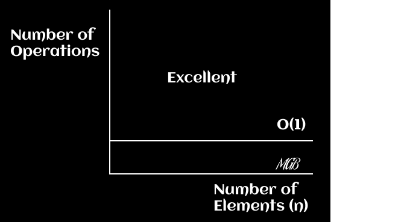
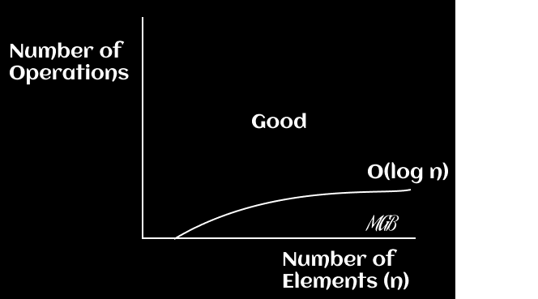
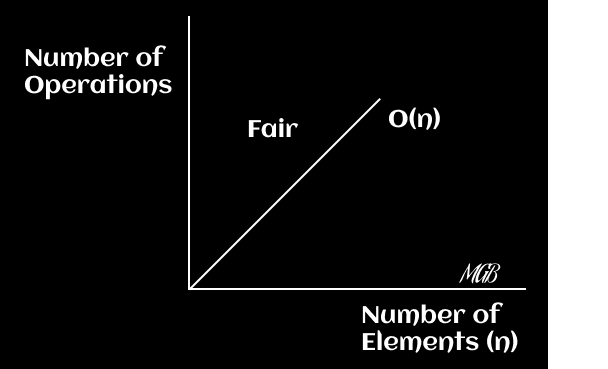
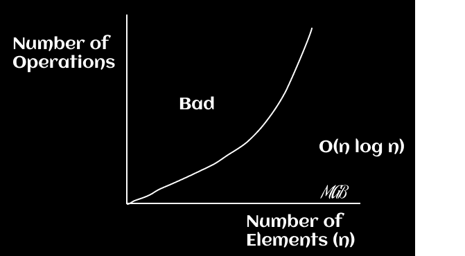
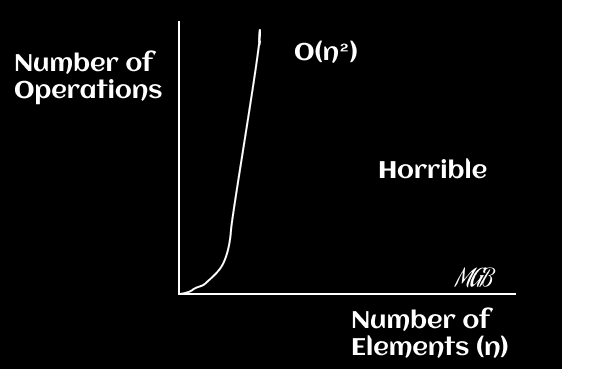
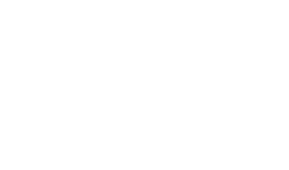
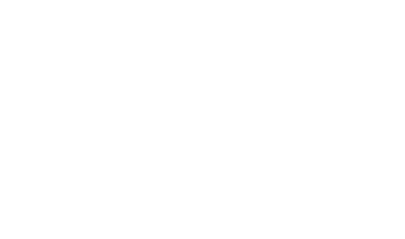
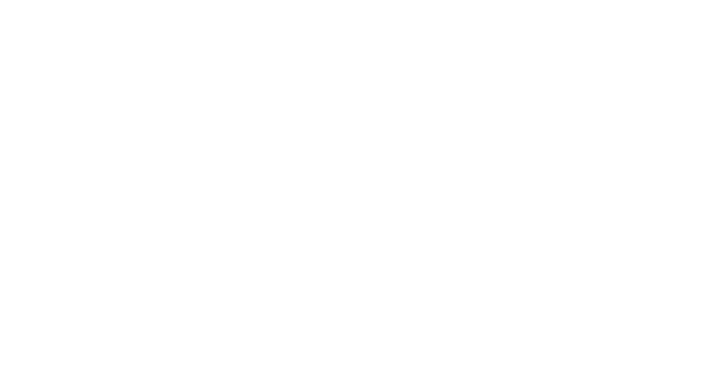

¡Bienvenidos nuevamente a la continuación de nuestra serie sobre Big O! Si esta es tu primera entrada al blog y estás interesado en este tema (muchas veces por necesidad debido a las entrevistas, pero interesado de alguna forma para mejorar...) es probable que te hayas hecho algunas de estas preguntas:

❓ ¿Cómo los ingenieros de software o los programadores, como prefieras llamarlos, evalúan la eficiencia de los algoritmos? ¿Cómo deciden cuál es el mejor método para resolver un problema específico? La respuesta a menudo se encuentra en un tipo de análisis matemático conocido como Notación Big O.

Big O es un componente esencial en informática que permite a los profesionales comparar la eficiencia de diferentes algoritmos en términos de tiempo de ejecución y recursos consumidos. Gracias a Big O, podemos prever cómo se comportará un algoritmo a medida que aumenta el volumen de datos. Esto es crucial para tomar decisiones informadas y objetivas sobre qué algoritmo utilizar en una situación dada.

En esta publicación, nos embarcaremos en un viaje a través de los diferentes tipos de Notación Big O, desde el tiempo constante `(O(1))` hasta el tiempo factorial `(O(n!))`, explorando cómo cada uno impacta en el rendimiento de nuestros algoritmos. Además, proporcionaremos ejemplos de código, ventajas y desventajas, así como algunas aplicaciones prácticas de cada uno. Y para ayudarte a visualizar cómo varía el tiempo de ejecución en función de los datos ingresados, también incluiremos gráficos descriptivos de cada tipo. Así que si estás listo para desentrañar los misterios de la Notación Big O, ¡comencemos 🏁!

## Constant Time - O(1)

El tiempo constante, denotado como `O(1)`, describe un algoritmo cuyo tiempo de ejecución es independiente de la cantidad de datos. Imagina que tienes un libro y quieres ver la primera página. No importa si el libro tiene 100 o 1.000 páginas, siempre te llevará la misma cantidad de tiempo abrirlo y ver la primera página. Este es un buen ejemplo del tiempo constante en la vida real: el número de páginas (datos) en el libro no afecta el tiempo que se necesita para realizar la operación (abrir la primera página).

Aquí te dejo un ejemplo a nivel de código de una función que no toma argumentos y siempre devuelve el mismo resultado. No depende de ninguna entrada y, por lo tanto, es un algoritmo de tiempo constante `O(1)`.

```javascript
const sayHello = () => 'Hello world';
```

**Ejemplos de Uso Común**
Un buen ejemplo de tiempo constante es acceder a un elemento específico en un array por su índice. Independientemente del tamaño del array, el tiempo de ejecución para acceder a un elemento por su índice será siempre el mismo.

1) Si tienes un array de millones de elementos y quieres acceder al elemento en el índice `500.000`, puedes hacerlo directamente y el tiempo que tomará no será afectado por la longitud del array.

```javascript
const array = [1, 2, 3, 4, 5, ..., 1,000,000];

console.log(array[500000]);
```

2) Determinar si un número es par o impar. Sin importar lo grande que sea el número, el tiempo de ejecución será el mismo.

```javascript
const isEven = (n) => n % 2 === 0;
```

3) Acceder a un valor en un objeto por su clave. Independientemente de cuántas propiedades tenga el objeto, siempre toma la misma cantidad de tiempo recuperar un valor si conoces la clave.

```javascript
const user = {
  name: 'Matías',
  age: 28,
  city: 'Córdoba',
  // Más propiedades...
};

console.log(user.name);
```

Espero que estos ejemplos te ayuden a ilustrar mejor el concepto de tiempo constante `O(1)`. Recuerda, la clave aquí es que el tiempo de ejecución no cambia, sin importar cuántos datos esté manejando el algoritmo.

**Ventajas y Desventajas**
Los algoritmos de tiempo constante son los más eficientes en términos de tiempo de ejecución. Esto es ideal para operaciones que se deben realizar rápidamente y que no dependen del número de elementos a procesar.

La desventaja, sin embargo, es que este tipo de algoritmos no son útiles para tareas que requieran procesar o manipular múltiples elementos de datos, como ordenar un array o buscar un elemento específico en una lista no ordenada.

**Diagramas**
En este caso, el tiempo de ejecución no cambia con el tamaño de la entrada. Así que si trazas esta función, simplemente obtienes una línea horizontal. En un plano `x-y`, puedes graficar la función `f(x) = 1`.

<p align="center"></p>

## **Logarithmic Time - O(log n)**

Un algoritmo de tiempo logarítmico, o `O(log n)`, es aquel cuyo tiempo de ejecución se reduce a la mitad con cada iteración del algoritmo. Imagina que estás buscando un número en una guía telefónica. En lugar de comenzar en la primera página y revisar cada número uno por uno, abres la guía por la mitad y decides si el número que buscas está antes o después de la página a la que abriste. Este proceso se repite hasta que encuentres el número. Eso es básicamente lo que hace un algoritmo de tiempo logarítmico.

Un ejemplo de un algoritmo de este tipo es la búsqueda binaria, que es usada para encontrar un elemento en una lista ordenada.

```javascript
const binarySearch = (list, item) => {
  let low = 0;
  let high = list.length - 1;

  while (low <= high) {
    let mid = Math.floor((low + high) / 2);
    let guess = list[mid];

    if (guess === item) {
      return mid;
    }

    if (guess < item) {
      low = mid + 1;
    } else {
      high = mid - 1;
    }
  }
  
  return null;
}
```

**Ejemplos de Uso Común**

- La búsqueda binaria se utiliza a menudo en aplicaciones de bases de datos. Cuando se busca un registro específico en una base de datos grande y ordenada, la búsqueda binaria puede encontrar rápidamente el registro. De igual manera, los árboles binarios de búsqueda, que son estructuras de datos basadas en la idea de la búsqueda binaria, son utilizados en muchas aplicaciones, incluyendo compiladores y sistemas de gestión de bases de datos.

- Búsqueda en un diccionario: Si estás buscando una palabra en un diccionario físico, no empezarías por la primera página y avanzarías una por una. En cambio, abrirías el diccionario aproximadamente a la mitad y determinarías si la palabra que buscas estaría antes o después en el diccionario, y luego repetirías el proceso en la mitad correspondiente.

- Adivinanzas numéricas: Si estás jugando un juego en el que tienes que adivinar un número entre 1 y 100, y en cada intento se te dice si tu suposición es demasiado alta o demasiado baja, una estrategia eficiente sería comenzar en el medio (50) y ajustar tus conjeturas hacia arriba o hacia abajo según las pistas. De esta manera, con cada conjetura, reduces a la mitad el rango de números posibles.

**Ventajas y Desventajas**

La mayor ventaja de los algoritmos de tiempo logarítmico es su eficiencia en conjuntos de datos grandes. A medida que el tamaño del conjunto de datos crece, el tiempo de ejecución de estos algoritmos crece de manera muy lenta en comparación con algoritmos de tiempo lineal o cuadrático.

No obstante, una desventaja de los algoritmos de tiempo logarítmico es que requieren datos ordenados, lo cual puede añadir tiempo adicional o resultar inviable en ciertas situaciones.

**Consejos para entender mejor O(log n)**

- Siempre recuerda que el logaritmo es el inverso de la exponenciación. Por lo tanto, si `2^3` = 8, entonces log<sub>2</sub>(8) = 3. Esto significa que necesitamos hacer 3 pasos en el peor de los casos para buscar un elemento en 8 elementos. Esta es la base de la búsqueda binaria.
- Es crucial entender que los algoritmos O(log n) requieren datos ordenados para funcionar correctamente. Esta es una consideración importante en su aplicación práctica.
- No confundas O(log n) con O(n log n). Este último es típico de algoritmos como el ordenamiento por mezcla o el ordenamiento rápido, que son más costosos en términos de tiempo de ejecución que los algoritmos O(log n).

**Diagramas**

En este caso, el tiempo de ejecución aumenta logarítmicamente con el tamaño de la entrada. Es decir, a medida que n se hace muy grande, el tiempo de ejecución aumenta, pero muy lentamente. En un plano x-y, puedes graficar la función f(x) = log(x).

<p align="center"></p>

## **Linear Time - O(n)**

El tiempo lineal, o `O(n)`, describe un algoritmo cuyo tiempo de ejecución aumenta de manera directamente proporcional a la cantidad de datos de entrada. Imagina que estás en una fila de personas y quieres darle la mano a cada una. La cantidad de tiempo que te tomará realizar esta tarea será proporcional al número de personas en la fila. Si hay 5 personas, te llevará 5 veces el tiempo que te llevaría si solo hubiera una persona. Este es el comportamiento típico de los algoritmos de tiempo lineal.

Un ejemplo de un algoritmo de tiempo lineal es recorrer una lista o un array de elementos, como en el siguiente código en JavaScript:

```javascript
const printColors = (colors) => {
  for (let i = 0; i < colors.length; i++) {
    console.log(colors[i]);
  }
}
```

**Ejemplos de Uso Común**

El tiempo lineal es común en muchos algoritmos de programación cotidiana.

- Cada vez que recorres una lista de elementos, como en una lista de tareas pendientes.
- Cuando filtras una lista de datos, estás utilizando algoritmos de tiempo lineal.
- Cambiar el color del texto de todos los elementos de una lista en una página web.
- Buscar un elemento específico en un array no ordenado.
- También son comunes en operaciones como el mapeo de una lista a otra y la clonación de arrays.

Todos estos ejemplos implican operaciones que se realizarán una vez por cada elemento del conjunto de datos.


**Ventajas y Desventajas**

El tiempo lineal es directo y fácil de entender. Su principal ventaja es que no tiene requerimientos específicos acerca de los datos, a diferencia del tiempo logarítmico que requiere que los datos estén ordenados.

Sin embargo, los algoritmos de tiempo lineal pueden ser ineficientes para conjuntos de datos muy grandes. Por ejemplo, si tienes que recorrer una lista de un millón de elementos, el tiempo de ejecución será proporcionalmente alto. Si un algoritmo de tiempo lineal toma 1 segundo para procesar 1000 elementos, este tardará aproximadamente 1000 segundos (o alrededor de 16 minutos y 40 segundos) para procesar 1 millón de elementos.

**Diagramas**

Aquí, el tiempo de ejecución aumenta linealmente con el tamaño de la entrada. Si la entrada se duplica, el tiempo de ejecución también se duplica. En un plano x-y, puedes graficar la función `f(x) = x`.

<p align="center"></p>

Al dominar el concepto del tiempo lineal, tendrás una mejor comprensión de cómo optimizar tus algoritmos para manejar conjuntos de datos grandes. Recuerda siempre considerar el tamaño de tus datos al elegir el algoritmo más eficiente para tu tarea.

## Super-Linear Time - O(n log n)

El tiempo super-lineal, o `O(n log n)`, describe un algoritmo cuyo tiempo de ejecución es superior al lineal pero inferior al cuadrático. Este tipo de complejidad temporal se encuentra a menudo en algoritmos que dividen el problema en subproblemas más pequeños, los resuelven de manera independiente y luego combinan las soluciones. Para entenderlo, imagina que estás ordenando una biblioteca de libros. Si tuvieras que comparar cada libro con cada otro libro (lo que sería tiempo cuadrático), te llevaría mucho tiempo. Pero si en cambio, pudieras dividir los libros en grupos más pequeños, ordenar esos grupos y luego combinar esos grupos ordenados, te tomaría menos tiempo. Este proceso de dividir y conquistar es más eficiente que los enfoques de tiempo cuadrático y es la esencia de algoritmos `O(n log n)` como el Merge Sort.

Un ejemplo de un algoritmo de tiempo superlineal es el algoritmo de ordenamiento Merge Sort:

```javascript
const mergeSort = (arr) => {
  // Si la longitud del array es menos que 2, se retorna el array tal como está.
  if (arr.length < 2) {
    return arr;
  }

  // Encuentra el índice medio del array.
  const middle = Math.floor(arr.length / 2);

  // Divide el array en dos mitades alrededor del índice medio.
  const left = arr.slice(0, middle);
  const right = arr.slice(middle);

  // Ordena recursivamente ambas mitades y luego las combina.
  return merge(mergeSort(left), mergeSort(right));
}

const merge = (left, right) => {
  const sorted = [];

  // Compara los elementos de las mitades izquierda y derecha,
  // y los coloca en el array 'sorted' en el orden correcto.
  while (left.length && right.length) {
    if (left[0] <= right[0]) {
      sorted.push(left.shift());
    } else {
      sorted.push(right.shift());
    }
  }

  // Combina el array 'sorted' con los restantes elementos de las mitades.
  return [...sorted, ...left, ...right];
}
```

**Ejemplos de Uso Común**

Los algoritmos de tiempo superlineal como `Merge Sort, Heap Sort y Quick Sort` son ampliamente utilizados en la vida real para ordenar grandes conjuntos de datos. Esto se debe a que son más eficientes que los algoritmos de ordenamiento cuadrático como `Bubble Sort o Insertion Sort`, especialmente para grandes volúmenes de datos.

**Ventajas y Desventajas**

La principal ventaja de los algoritmos de tiempo superlineal es su eficiencia en conjuntos de datos de gran tamaño. Esto se debe a que el número de comparaciones requeridas crece más lentamente que el tamaño de la entrada. Sin embargo, estos algoritmos suelen ser más complejos de implementar y entender que los algoritmos de tiempo lineal. Además, algunos de ellos, como Merge Sort, necesitan espacio adicional en memoria para almacenar una copia temporal de los datos, lo que puede ser costoso para conjuntos de datos muy grandes.

**Diagramas**

En este caso, el tiempo de ejecución es mayor que lineal pero menos que polinomial. Típicamente, algoritmos como el de ordenación rápida caen en esta categoría. Puedes graficar la función `f(x) = x * log(x)`.

<p align="center"></p>

Comparaciones con los mencionados `O(n)` y `O(n^2)`

<p align="center"></p>

💡 **Consejo**

Al enfrentarte a problemas de codificación que implican ordenar o buscar en grandes conjuntos de datos, recuerda que los algoritmos `O(n log n)` son una opción muy eficiente. No obstante, también es importante tener en cuenta los recursos de memoria disponibles, ya que algunos de estos algoritmos pueden requerir espacio adicional. Recuerda siempre sopesar los pros y los contras en función de las especificaciones de tu problema en particular. Al final del día, la correcta elección y implementación de los algoritmos puede hacer una gran diferencia en el rendimiento de tu aplicación.

**Conclusión**

El tiempo super-lineal o `O(n log n)` es una complejidad algorítmica que encuentra un equilibrio efectivo entre simplicidad y eficiencia. Los algoritmos que tienen esta complejidad, como Merge Sort o Quick Sort, suelen ser una excelente opción para manipular grandes conjuntos de datos, ya que aumentan su tiempo de ejecución de forma más lenta en comparación con algoritmos de tiempo cuadrático. Sin embargo, el costo de esta eficiencia puede ser un mayor uso de memoria y una implementación más compleja.

## Polynomial Time - O(n^2)

El tiempo polinomial, denotado como `O(n^k)`, describe un algoritmo cuyo tiempo de ejecución es proporcional a una potencia `k` del tamaño de la entrada. Un caso común es `O(n^2)`, que ocurre cuando necesitas recorrer una lista de elementos dos veces - una vez para cada elemento de la lista. Imagina que estás en una fiesta y debes dar la mano a cada persona. Para cada individuo `(n)`, debes saludar a todos los demás `(n-1)`. Este caso, que es cuadrático, es solo un ejemplo de tiempo polinomial, ya que el tiempo polinomial también puede referirse a complejidades como `O(n^3)`, `O(n^4)`, y así sucesivamente.

Un ejemplo clásico de un algoritmo de tiempo polinomial es el Bubble Sort. Este algoritmo de ordenamiento funciona recorriendo la lista varias veces y, en cada pasada, compara cada elemento con el siguiente y los intercambia si están en el orden incorrecto. Este proceso se repite hasta que la lista está ordenada.

```javascript
const bubbleSort = (arr) => {
  for (let i = 0; i < arr.length; i++) {
    for (let j = 0; j < arr.length - i - 1; j++) {
      if (arr[j] > arr[j + 1]) {
        const temp = arr[j];
        arr[j] = arr[j + 1];
        arr[j + 1] = temp;
      }
    }
  }
  return arr;
}
```

Un buen ejemplo de un algoritmo de tiempo cúbico `O(n^3)` en el contexto de una plataforma de comercio electrónico podría ser una función que compara cada combinación posible de tres productos diferentes para determinar si cumplen ciertos criterios.

Por ejemplo, supongamos que estamos buscando una combinación de tres productos cuya suma total de precios sea igual a un valor determinado (como en el problema del `subset-sum`). El código sería algo como lo siguiente:

```javascript
function findProductCombination(products, targetPrice) {
  for (let i = 0; i < products.length; i++) {
    for (let j = i + 1; j < products.length; j++) {
      for (let k = j + 1; k < products.length; k++) {
        if (products[i].price + products[j].price + products[k].price === targetPrice) {
          return [products[i], products[j], products[k]];
        }
      }
    }
  }
  return null;
}
```

La función `findProductCombination` tiene una complejidad de tiempo de `O(n^3)`, ya que hay tres bucles anidados, cada uno de los cuales puede recorrer potencialmente la totalidad de la lista de productos. Esto sería necesario si estuviésemos buscando una combinación específica de tres productos que sumen un precio objetivo, y la única forma de encontrarla sería revisar todas las posibles combinaciones de tres productos.

Sin embargo, es importante señalar que este tipo de algoritmo puede ser muy ineficiente para grandes conjuntos de datos, ya que el tiempo de ejecución aumenta al cubo del tamaño de la lista de productos. En la mayoría de los casos, sería preferible encontrar una solución más eficiente, especialmente si estás trabajando con un gran catálogo de productos.

**Ejemplos de Uso Común**

Los algoritmos de tiempo polinomial, como Bubble Sort, Insertion Sort y Selection Sort, tienen su lugar cuando los conjuntos de datos son pequeños, o la simplicidad del código es una ventaja, a pesar de que su tiempo de ejecución puede crecer rápidamente a medida que aumenta el tamaño del conjunto de datos.

**Ventajas y Desventajas**

La ventaja de los algoritmos de tiempo polinomial radica en su simplicidad para entender e implementar. Además, pueden ser efectivos para conjuntos de datos pequeños. Sin embargo, su principal desventaja es su escalabilidad. A medida que el tamaño del conjunto de datos aumenta, el tiempo de ejecución de estos algoritmos puede volverse prohibitivamente grande.

**Diagramas**

El tiempo de ejecución es proporcional al cuadrado (o cubo, etc.) del tamaño de la entrada. Puedes graficar la función `f(x) = x^2` para `O(n^2)` y `f(x) = x^3` para `O(n^3)`.

<p align="center"></p>

**Conclusiones**
En tu análisis de los algoritmos y su complejidad, es importante recordar que el hecho de que un algoritmo tenga una complejidad de tiempo polinómica (como `O(n^2)` o `O(n^3)`) no lo hace necesariamente "malo". Depende del contexto y del tamaño de los datos con los que estás trabajando como muchas cosas en programación siempre hay que tener en cuenta el contexto adicional que tenemos en el momento.

Para conjuntos de datos pequeños, un algoritmo polinomial puede ser adecuado e incluso preferible por su simplicidad. Sin embargo, a medida que el tamaño del conjunto de datos aumenta, estos algoritmos pueden volverse muy ineficientes.

Además, ten en cuenta que, aunque un algoritmo puede tener una peor complejidad de tiempo en la teoría, puede tener mejoras significativas en la práctica debido a las optimizaciones del compilador o de la máquina subyacente que utilizamos como servidor.

Un buen desarrollador siempre busca el equilibrio entre la eficiencia, la legibilidad y la mantenibilidad del código, donde actualmente por las maquinas que tenemos acceso la legibilidad y la mantenibilidad de código suelen ser las mayores prioridades que tenemos. Si bien es importante ser consciente de la eficiencia del algoritmo, la claridad y la simplicidad del código también son cruciales en la mayoría de los entornos que se programan hoy en día en la web.

Por último, en casos donde la eficiencia es crucial y estás tratando con grandes conjuntos de datos, puedes considerar otras técnicas como algoritmos de ordenamiento más eficientes (como merge sort o quicksort), algoritmos de búsqueda eficientes (como la búsqueda binaria), o estructuras de datos eficientes (como los árboles de búsqueda binaria).

## Exponential Time - O(2^n)

Los algoritmos con tiempo de ejecución exponencial, o `O(2^n)`, tienen un tiempo de ejecución que crece exponencialmente con cada nuevo elemento en la entrada. Esto significa que cada elemento adicional puede duplicar (o más) el tiempo de ejecución.

Un ejemplo clásico de un algoritmo de tiempo exponencial es el algoritmo recursivo para calcular los números de Fibonacci. La secuencia de Fibonacci es una serie en la que cada número es la suma de los dos números anteriores, y empieza así: 1, 1, 2, 3, 5, 8, 13...

La implementación recursiva del cálculo de los números de Fibonacci es la siguiente:

```javascript
const fibonacci = (num) => {
  if (num <= 1) return num;
  
  return fibonacci(num - 1) + fibonacci(num - 2);
}
```

Esto demuestra la naturaleza de la recursividad, donde una función se llama a sí misma dentro de su propia definición.

**Ejemplos de Uso Común**

Aunque los algoritmos con tiempo exponencial no se utilizan comúnmente en aplicaciones reales debido a su ineficiencia, tienen un valor didáctico muy alto. Sirven para entender conceptos fundamentales de la recursividad y cómo la eficiencia de un algoritmo puede variar drásticamente según su implementación.

Un ejemplo podría ser un sistema de recomendación de productos que intente encontrar todas las combinaciones posibles de productos para maximizar el valor del carrito de la compra del cliente sin exceder un determinado presupuesto. Este es una variante del problema de la mochila (Knapsack Problem a fuerza bruta) y su resolución directa puede implicar un tiempo de ejecución exponencial.

**Ventajas y Desventajas**

La ventaja de los algoritmos de tiempo exponencial es su simplicidad conceptual, especialmente al mostrar cómo funcionan los algoritmos recursivos. No obstante, su principal desventaja es su ineficiencia con conjuntos de datos más grandes, donde pueden causar un desempeño considerablemente lento o incluso llegar a bloquear completamente el programa.

Aunque en su forma más simple la función de Fibonacci tiene un tiempo exponencial, se puede optimizar utilizando técnicas como la memorización para reducir la complejidad a tiempo lineal.

**Diagramas**

El tiempo de ejecución crece exponencialmente con cada adición a la entrada. Este es uno de los tiempos de ejecución menos eficientes y puede verse en algunos problemas de búsqueda y optimización. Puedes graficar la función f(x) = `2^x`.

<p align="center"></p>

## Factorial Time- O(n!)

Los algoritmos con tiempo de ejecución factorial, o `O(n!)`, tienen un tiempo de ejecución que crece extremadamente rápido con cada nuevo elemento en la entrada. Estos algoritmos suelen ser los menos eficientes y su uso se limita a conjuntos de datos muy pequeños. El ejemplo más conocido de un algoritmo de tiempo factorial es el problema del viajante de comercio utilizando la estrategia de fuerza bruta.

El problema del viajante de comercio plantea la siguiente pregunta: "Dada una lista de ciudades y las distancias entre cada par de ciudades, ¿cuál es la ruta más corta posible que visita cada ciudad exactamente una vez y regresa a la ciudad de origen?" La estrategia de fuerza bruta para resolver este problema implica generar todas las posibles permutaciones de las ciudades e identificar la ruta con la menor distancia total, de ahí su complejidad de `O(n!)`.

```javascript
// Este es un pseudocódigo, no es una solución completa para el problema del viajante de comercio
// Las funciones generateAllPermutations y calculateTotalDistance no están implementadas en este ejemplo
const travellingSalesman = (cities) => {
  let shortestDistance = Infinity;
  let shortestPath;

  const permutations = generateAllPermutations(cities);
  
  permutations.forEach((path) => {
    const distance = calculateTotalDistance(path);
    
    if (distance < shortestDistance) {
      shortestDistance = distance;
      shortestPath = path;
    }
  });
  
  return shortestPath;
};
```

**Ejemplos de Uso Común**

Los algoritmos de tiempo factorial se utilizan a menudo en la generación de permutaciones de un conjunto de datos. Por ejemplo, pueden ser útiles en ciertos campos como la criptografía, donde la generación de todas las posibles claves es necesaria para un ataque de fuerza bruta. En general, se evitan estos algoritmos debido a su rendimiento extremadamente pobre para tamaños de entrada grandes. No obstante, en ciertos problemas como el del viajante de comercio, la fuerza bruta (aunque ineficiente) puede proporcionar la solución óptima.

**Ventajas y Desventajas**

El algoritmo de tiempo factorial puede ser útil cuando se necesita una solución óptima y el tamaño de entrada es muy pequeño. Sin embargo, para conjuntos de datos más grandes, estos algoritmos son impracticables debido a su crecimiento factorial extremadamente rápido.

**Diagramas**

El tiempo de ejecución crece extremadamente rápido y es el peor caso de complejidad. Puedes graficar la función `f(x) = x!` (factorial de x).

<p align="center"></p>

**Consejos**

- Minimiza el uso de algoritmos `O(n!)` siempre que sea posible: Aunque pueden ser necesarios para ciertos problemas, la complejidad factorial tiende a hacer que estos algoritmos sean inviables para conjuntos de datos de tamaño considerable. Siempre busca alternativas más eficientes antes de recurrir a un enfoque de fuerza bruta.

- Utiliza estrategias de optimización: Si te encuentras en una situación en la que un algoritmo O(n!) es necesario, considera técnicas de optimización como la poda, que puede eliminar ciertas ramas de cálculo si no es probable que produzcan una solución óptima.

- Analiza el tamaño de tu entrada: A veces, un algoritmo `O(n!)` puede ser adecuado si sabes que tu conjunto de datos siempre será pequeño. En estos casos, la simplicidad de implementación puede ser más importante que la eficiencia.

**Conclusión**

Los algoritmos de tiempo factorial representan un límite en términos de ineficiencia en la informática. Aunque pueden ser útiles para ciertos problemas, su aplicación en la vida real es limitada debido a su exponencial crecimiento de tiempo de ejecución. La comprensión de estos algoritmos sirve para reforzar la importancia de la eficiencia en la informática y subraya la necesidad de buscar enfoques más optimizados para resolver problemas. Aprender a identificar y manejar estos casos puede ser una habilidad invaluable para cualquier programador.

## Graphing Big-O Notation

Aquí hay un gráfico que muestra los tiempos de ejecución de `Big-O` mencionados anteriormente y su rendimiento a medida que aumenta el tamaño de los datos
de entrada.

El **tiempo constante** es el tiempo de ejecución con **mayor rendimiento** y el **tiempo factorial** es el de **peor rendimiento**.

<p align="center"></p>

✍️ **Conclusión Final**

Entender la notación Big-O es crucial para cualquier desarrollador de software. Proporciona un lenguaje universal para discutir el rendimiento de los algoritmos y nos ayuda a tomar decisiones más informadas al seleccionar las estructuras de datos y algoritmos adecuados para nuestros programas. Este conocimiento no sólo te ayudará a ser un programador más eficiente, sino que también será invaluable durante las entrevistas técnicas, donde a menudo se espera que justifiques tus elecciones de algoritmos y estructuras de datos con referencia a su complejidad de tiempo y espacio.

🪔 **Consejos Finales**

- **Práctica, práctica, práctica**: Como con cualquier concepto en informática, la mejor manera de entender realmente la notación Big-O es aplicándola en la práctica. Intenta identificar la complejidad de tiempo y espacio de los algoritmos en tu propio código y en los problemas de entrevista técnica.

- **No sobreoptimices**: Aunque siempre es importante tener en cuenta la eficiencia, recuerda que la legibilidad y la mantenibilidad del código son igualmente importantes. No todas las situaciones requieren el algoritmo más eficiente posible, especialmente si eso hace que el código sea más difícil de entender y mantener.

- **Aprende a equilibrar**: La elección del algoritmo o estructura de datos correcta a menudo depende de un equilibrio entre el tiempo y el espacio. A veces, puedes conseguir un tiempo de ejecución más rápido utilizando más memoria, o ahorrar memoria con un tiempo de ejecución más lento. Aprender a manejar este equilibrio es una habilidad clave para cualquier programador.

Espero que esta publicación te haya proporcionado una visión clara de lo que es la notación Big-O y cómo se utiliza en la programación para analizar la eficiencia de los algoritmos. Tu camino para convertirte en un desarrollador de software eficiente y consciente de la eficiencia está bien encaminado, aunque esto es solo una pizca de conocimiento el comienzo de un largo camino.

También puedes encontrar la versión en inglés ingresando a [Blog Rooftop](https://tinyurl.com/big-o-part-3)

Gracias por leer esta serie de complejidad algorítmica y espero verte en futuras publicaciones, aunque quizás pueda ser sobre algún tema diferente. ¡Hasta la próxima!

## Referencias
Si te interesa profundizar más en el tema de la complejidad del tiempo y cómo afecta la eficiencia de tus programas, puedes consultar los siguientes recursos:

- Libro: "Introduction to the Design and Analysis of Algorithms" por Anany Levitin.
- Libro: "Algorithms Unlocked" de Thomas H. Cormen.
- Libro: "Algorithms" de Robert Sedgewick and Kevin Wayne.
- Libro: "Algorithm Design Manual" de Steven S. Skiena.
- Libro: "Introduction to Algorithms - Fourth Edition" Thomas H. Cormen, Charles E. Leiserson, Ronald Rivest, Clifford Stein.

- Curso en línea: [Khan Academy: Algorithms](https://www.khanacademy.org/computing/computer-science/algorithms)
- Curso en línea: [GeekforGeeks: Binary Search](https://www.geeksforgeeks.org/binary-search/)
- Curso en línea: [Coursera: Algorithms, Part I](https://www.coursera.org/learn/algorithms-part1)
- Curso en línea: [Harvard's CS50: Introduction to Computer Science](https://www.edx.org/course/introduction-computer-science-harvardx-cs50x)
- Curso en línea: [Introduction to Algorithms by MIT](https://ocw.mit.edu/courses/6-006-introduction-to-algorithms-fall-2011/)
- Curso en línea: [Algorithms, Part I by Princeton University](https://www.coursera.org/learn/algorithms-part1)
- Curso en línea: [Discrete Optimization by The University of Melbourne](https://www.coursera.org/learn/discrete-optimization)

- Video: [Logarithms in Computer Science](https://www.youtube.com/watch?v=kjDR1NBB9MU).
- Video: [Big O Notations (simple explanation)](https://www.youtube.com/watch?v=__vX2sjlpXU)
- Video: [Big O Notations](https://www.youtube.com/watch?v=v4cd1O4zkGw) de la serie "Computer Science Basics" por HackerRank en YouTube.
- Video: [Merge Sort vs. Quick Sort](https://www.youtube.com/watch?v=es2T6KY45cA)
- Video: [Bubble Sort Algorithm](https://www.youtube.com/watch?v=6Gv8vg0kcHc)
- Video: [The Travelling Salesman Problem](https://www.youtube.com/watch?v=zM5MW5NKZJg)
