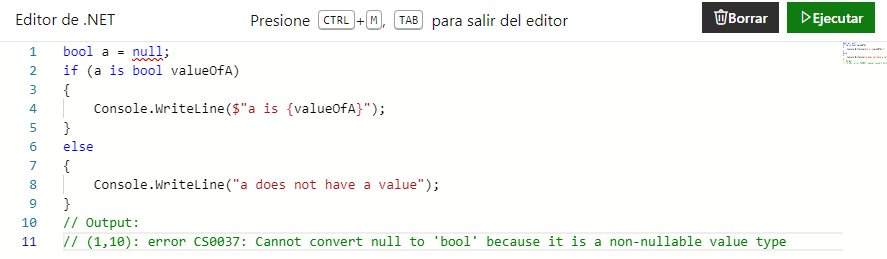
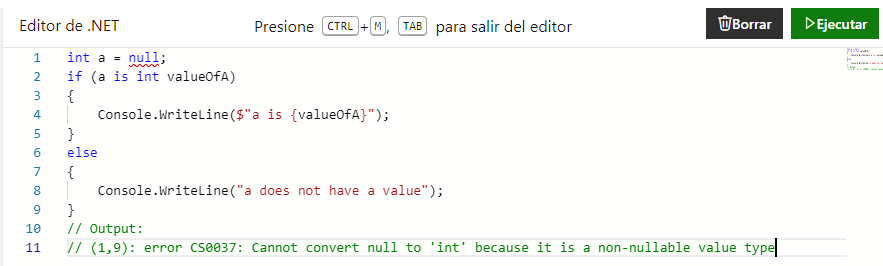
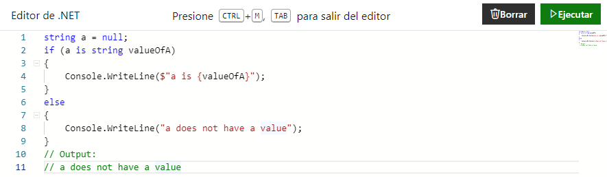
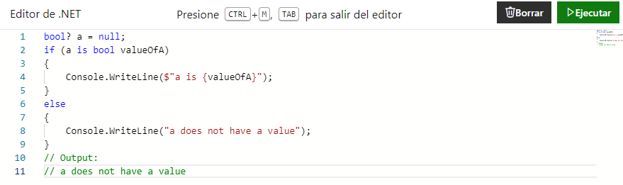
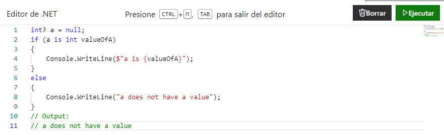
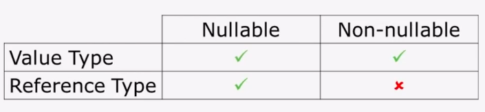

En este punto de la serie que venimos viendo sobre objetos y algunas buenas prácticas de desarrollo,
creo que es importante hacer un pequeño desvío y hablar sobre los tipos anulables (_Nullable_) y no anulables (_Non-nullable_).

Muchas plataformas de lenguajes orientados a objetos, como, por ejemplo, .NET, operan con tipos de valor y tipos de referencia. Los tipos de valor son tipos primitivos como enteros, booleanos, decimales y a veces fechas o UUIDs u algún otro del estilo. Y tienden a ser no anulables por defecto.

Ejemplos en `.NET`:
#### ✅ Booleans 
<p align="center"></p>

#### 9️⃣ Integers 
<p align="center"></p>

Por otro lado, los tipos de referencia, como las clases u objetos, tienden a ser anulables por defecto. Un ejemplo de esto podría ser el tipo "string", que aunque parezca primitivo, es anulable al menos en el caso de .NET.

#### 🅰 Strings 
<p align="center"></p>

Y entonces, por ejemplo, llegaron los genéricos en `.NET 2.0`, y con los genéricos se obtuvo este tipo llamado `Nullable<T>`,
que permitió definir un tipo de valor anulable.

#### ✅ Booleans 
<p align="center"></p>

#### 9️⃣ Integers 
<p align="center"></p>

Pero desafortunadamente, no es posible adaptar el otro caso, es decir, un tipo de referencia no anulable al menos en las plataformas existentes y nos queda una tabla para el lenguaje de este estilo.

<p align="center"></p>

Anders Hejlsberg, quien es el inventor de `.NET y C#`, en una entrevista dijo que es muy desafortunado que la tabla se vea así de esa manera,
pero desafortunadamente no es posible adaptar un tipo de referencia a ser no anulable en el sistema de tipos existente porque significaría
tantos cambios radicales que simplemente no es prácticamente útil. Y eso es realmente una pena porque un tipo de referencia que es anulable por defecto es realmente una invención horrible.
De hecho, el inventor del tipo de referencia anulable admite esto él mismo.

### 💵 Null References: The Billion Dollar Mistake - Tony Hoare 

El inventor del tipo de referencia anulable es Tony Hoare, quien inventó e implementó la referencia anulable cuando estaba diseñando
`Algol W` en la década de 1960, y simplemente lo implemento porque le pareció sencillo de hacerlo.
Y posteriormente en una de sus conferencias ha declarado que considera esto su error de mil millones de dólares porque surgen tantos problemas
de las excepciones de referencia nula a través de varios lenguajes y plataformas que simplemente el costo a pagar en muchos sistemas que generan estos errores es altísimo.

### 🔎 Problemática 

Resulta que un tipo de referencia nula es una característica de lenguaje realmente problemática, no porque el nulo en sí mismo sea
un concepto defectuoso, sino simplemente porque no puedes declarar si un tipo de referencia debería ser anulable o no, básicamente no tenemos elección.

Así que todas las referencias son siempre anulables, lo que significa que no podemos distinguir entre los casos donde el nulo es válido y donde el nulo no es válido.
Y eso lo hace realmente problemático. Seguramente en otros posts mediante ejemplos comentemos sobre el tema.

En .NET, los tipos de valor (como enteros, booleanos, decimales, fechas, UUIDs) son inherentemente no anulables, lo que significa que siempre deben contener un valor.
Esta decisión de diseño proviene de la forma en que estos tipos se almacenan directamente en la memoria, a menudo en la pila,
lo que los hace más eficientes para ciertas operaciones, pero también significa que no pueden representar la ausencia de un valor sin mecanismos adicionales como veremos en un ratito.

Por otro lado, los tipos de referencia se almacenan en el `heap` con una referencia (o puntero) que indica su ubicación en la memoria.
Dado que esta referencia puede apuntar a 'nada' (nulo), los tipos de referencia son anulables por defecto,
lo que les permite representar la ausencia de un objeto.

Esta anulabilidad por defecto puede llevar a excepciones de referencias nulas, estas excepciones ocurren cuando el código intenta acceder a miembros (como métodos o propiedades)
de un objeto que es nulo, lo que lleva a errores en tiempo de ejecución que son una fuente común de errores en el software como seguramente a más de uno les haya pasado que salte
la tan preciada llamada `NullPointerException` de Java, `NullReferenceException` en C# o `TypeErrors` como podría ser en TypeScript o PHP.

### 📋 Ejemplos Nullable Types 

La introducción de tipos de valor anulables en .NET a través de genéricos (mediante la estructura Nullable<T>) fue una mejora significativa,
ya que permitió a los tipos de valor representar también explícitamente la ausencia de un valor.
Esta característica podría ser útil para operaciones de base de datos por ejemplo al buscar un usuario o alguna otra entidad donde es probable que nuestro método de busqueda pueda o no encontrar ese objeto en cuestión.

```ts
interface UserRepository {
 search(id: UserId): Nullable<User>;
}
```

Di el caso de C# en general con la plataforma .NET porque suele tener los conceptos como la mayoría de los tipados orientados a objetos. Pero veremos el caso de TypeScript en particular también,
aunque más allá de cada lenguaje o plataforma en particular la idea es que se entiendan los conceptos y como suelen ser en general, siempre existen ciertas condiciones particulares de cada lenguaje
que me parece interesante tratarlo ya que en general uno suele decir "depende" y es verdad pero esta bueno ejemplificarlo un poco con algunos lenguajes algo diferentes en ciertos comportamientos.

### 👨‍💻 TypeScript 

Sí, la discusión sobre tipos anulables y no anulables también es relevante en TypeScript, recordemos que es un metalenguaje de programación que se basa en JavaScript y añade tipado estático opcional.
TypeScript fue diseñado para ayudar a los desarrolladores a manejar y prevenir muchos tipos de errores en tiempo de "compilación" o más bien de transpilación,
incluidos los errores comunes relacionados con valores `nulos o indefinidos`.

Por defecto, TypeScript permite que los valores sean `null o undefined`, lo que significa que cualquier tipo puede ser asignado con `null o undefined` a menos que se especifique lo contrario (mediante el strictNullChecks y el no tiparlos como disponibles).
Sin embargo, TypeScript introdujo una característica llamada "strict null checks" (comprobaciones estrictas de nulos) en la versión 2.0, que, cuando se habilita, hace que los tipos sean no anulables por defecto.
Con esta característica habilitada, si intentas asignar `null o undefined` a una variable que no está explícitamente marcada para aceptar esos valores, TypeScript generará un error de compilación.

Por ejemplo, si tienes una variable de tipo `string`, no podrás asignarle `null o undefined` a menos que el tipo sea `string | null | undefined`, lo que indica explícitamente que la variable puede
contener un string, ser nula o indefinida.

```ts
let myString: string = "hello";
myString = null; // Error si las comprobaciones estrictas de nulos están habilitadas
```

Para permitir explícitamente valores `null o undefined`, puedes utilizar la unión de tipos, como se muestra a continuación:

```ts
let myString: string | null | undefined = "hello";
myString = null; // Permitido
```

Esta capacidad de especificar explícitamente cuándo un tipo puede ser null o undefined ayuda a prevenir errores en tiempo de ejecución relacionados con el acceso a propiedades o la
invocación de métodos en valores `null o undefined`, lo que mejora la seguridad y la previsibilidad del código.

En resumen, TypeScript adopta un enfoque flexible hacia los tipos anulables y no anulables, permitiendo a los desarrolladores elegir la estrategia que mejor se adapte a sus necesidades,
al tiempo que proporciona herramientas como `strictNullChecks` para mejorar la seguridad del tipo y reducir los errores comunes relacionados con los valores `null y undefined`.

<p align="center"></p>
